# Pixel Spirit Deck re-code

This is a re-code of the pixel spirit deck shaders for p5js.

Pixel spirit deck : https://patriciogonzalezvivo.github.io/PixelSpiritDeck/

I tried to animate each card taking it's meaning into account. 

I only used color for the empreror and the empress. 

The code progression is not respected, this means that you'll risk to find complicated stuff in the early cards.

The code itself it sometimes widely changed. I keep all the functions used in the fragment shader until the current card. Meaning the last ones will have a huge amount of code not needed per say.

All the functions will be published to a public gist at the end of the process.

[VOID](https://b2renger.github.io/p5js_pixel-spirit-deck_shaders/00_void/)

[JUSTICE](https://b2renger.github.io/p5js_pixel-spirit-deck_shaders/01_justice/)

[STRENGTH](https://b2renger.github.io/p5js_pixel-spirit-deck_shaders/02_strength/)

[DEATH](https://b2renger.github.io/p5js_pixel-spirit-deck_shaders/03_death/)

[THE WALL](https://b2renger.github.io/p5js_pixel-spirit-deck_shaders/04_the_wall/)

[TEMPERANCE](https://b2renger.github.io/p5js_pixel-spirit-deck_shaders/05_temperance/)

[BRANCH](https://b2renger.github.io/p5js_pixel-spirit-deck_shaders/06_branch/)

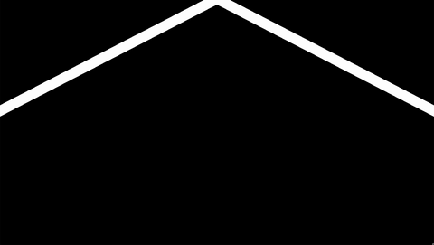

[THE HANGED MAN](https://b2renger.github.io/p5js_pixel-spirit-deck_shaders/07_the_hangedman/)

[THE HIGH PRIESTESS](https://b2renger.github.io/p5js_pixel-spirit-deck_shaders/08_the_high_priestess/)

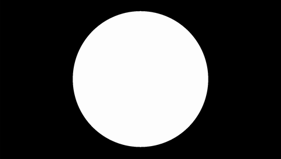

[THE MOON](https://b2renger.github.io/p5js_pixel-spirit-deck_shaders/09_the_moon/)

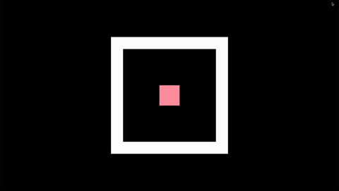

[THE EMPEROR](https://b2renger.github.io/p5js_pixel-spirit-deck_shaders/10_the_emperor/)

[THE HIEROPHANT](https://b2renger.github.io/p5js_pixel-spirit-deck_shaders/11_the_hierophant/)

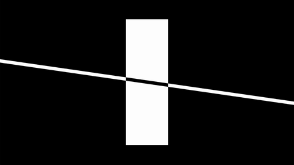

[THE TOWER](https://b2renger.github.io/p5js_pixel-spirit-deck_shaders/12_the_tower/)

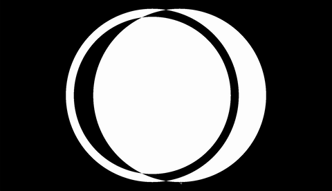

[MERGE](https://b2renger.github.io/p5js_pixel-spirit-deck_shaders/13_merge/)

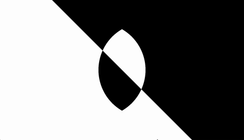

[HOPE](https://b2renger.github.io/p5js_pixel-spirit-deck_shaders/14_hope/)

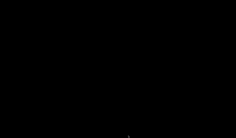

[THE TEMPLE](https://b2renger.github.io/p5js_pixel-spirit-deck_shaders/15_the_temple/)

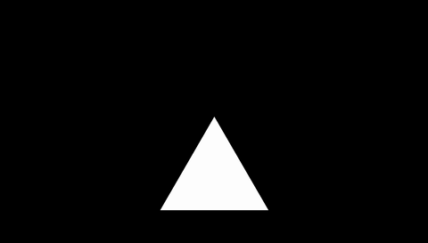

[THE SUMMIT](https://b2renger.github.io/p5js_pixel-spirit-deck_shaders/16_the_summit/)

[THE DIAMOND](https://b2renger.github.io/p5js_pixel-spirit-deck_shaders/17_the_diamond/)

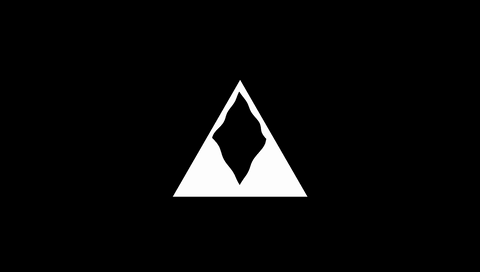

[THE HERMIT](https://b2renger.github.io/p5js_pixel-spirit-deck_shaders/18_the_hermit/)

[INTUITION](https://b2renger.github.io/p5js_pixel-spirit-deck_shaders/19_intuition/)

[THE STONE](https://b2renger.github.io/p5js_pixel-spirit-deck_shaders/20_the_stone/)

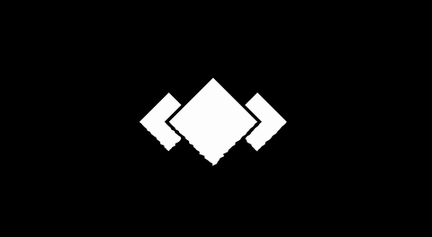

[THE MOUTAIN](https://b2renger.github.io/p5js_pixel-spirit-deck_shaders/21_the_mountain/)

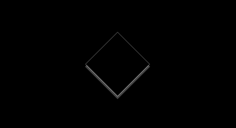

[THE SHADOW](https://b2renger.github.io/p5js_pixel-spirit-deck_shaders/22_the_shadow/)

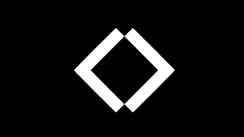

[OPPOSITE](https://b2renger.github.io/p5js_pixel-spirit-deck_shaders/23_opposite/)

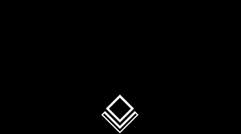

[THE OAK](https://b2renger.github.io/p5js_pixel-spirit-deck_shaders/24_the_oak/)

[RIPPLES](https://b2renger.github.io/p5js_pixel-spirit-deck_shaders/25_ripples/)

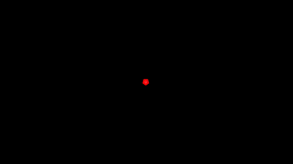

[THE EMPRESS](https://b2renger.github.io/p5js_pixel-spirit-deck_shaders/26_the_empress/)

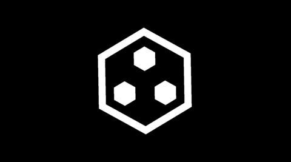

[BUNDLE](https://b2renger.github.io/p5js_pixel-spirit-deck_shaders/27_bundle/)

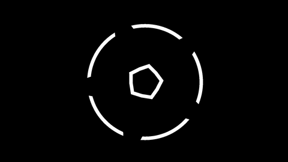

[THE DEVIL](https://b2renger.github.io/p5js_pixel-spirit-deck_shaders/28_the_devil/)

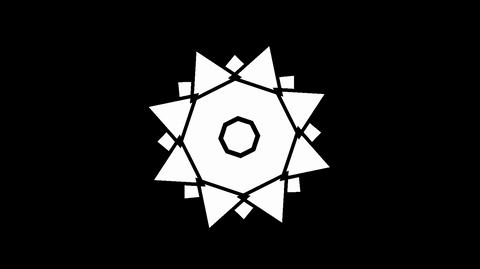

[THE SUN](https://b2renger.github.io/p5js_pixel-spirit-deck_shaders/29_the_sun/)

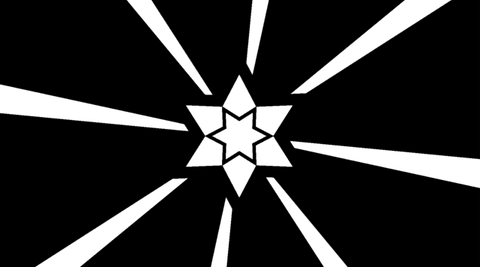

[THE STAR](https://b2renger.github.io/p5js_pixel-spirit-deck_shaders/30_the_star/)

[JUDGEMENT](https://b2renger.github.io/p5js_pixel-spirit-deck_shaders/31_judgement/)

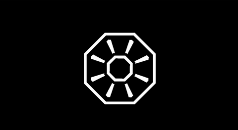

[WHEEL OF FORTUNE](https://b2renger.github.io/p5js_pixel-spirit-deck_shaders/32_wheel_of_fortune/)

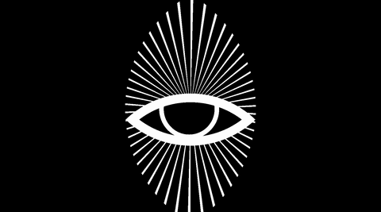

[VISION](https://b2renger.github.io/p5js_pixel-spirit-deck_shaders/33_vision/)

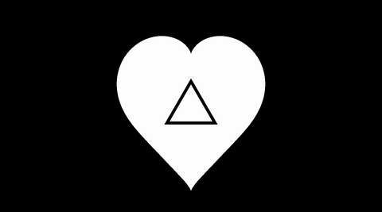

[THE LOVERS](https://b2renger.github.io/p5js_pixel-spirit-deck_shaders/34_the_lovers/)

[THE MAGICIAN](https://b2renger.github.io/p5js_pixel-spirit-deck_shaders/35_the_magician/)

[THE LINK](https://b2renger.github.io/p5js_pixel-spirit-deck_shaders/36_the_link/)

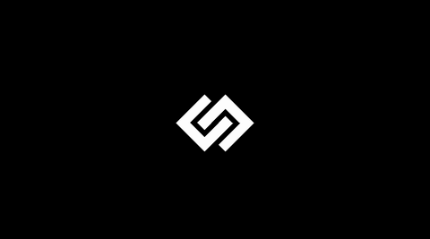

[HOLDING TOGETHER](https://b2renger.github.io/p5js_pixel-spirit-deck_shaders/37_holding_together/)

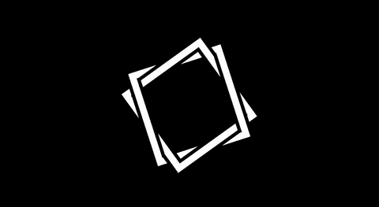

[THE CHARIOT](https://b2renger.github.io/p5js_pixel-spirit-deck_shaders/38_the_chariot/)